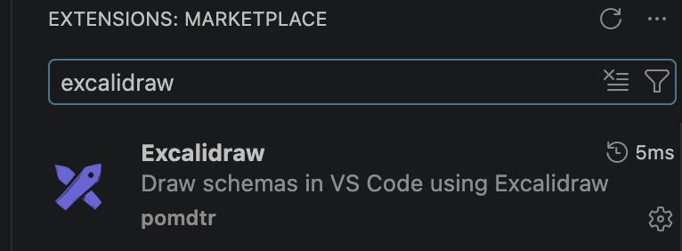
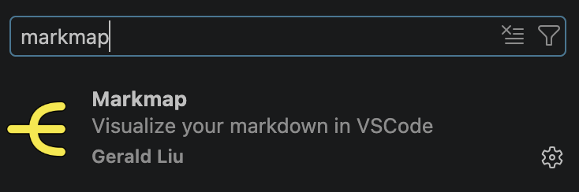
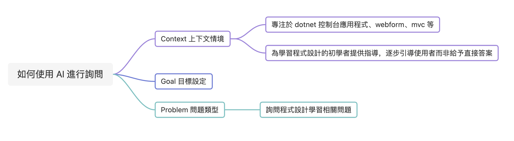
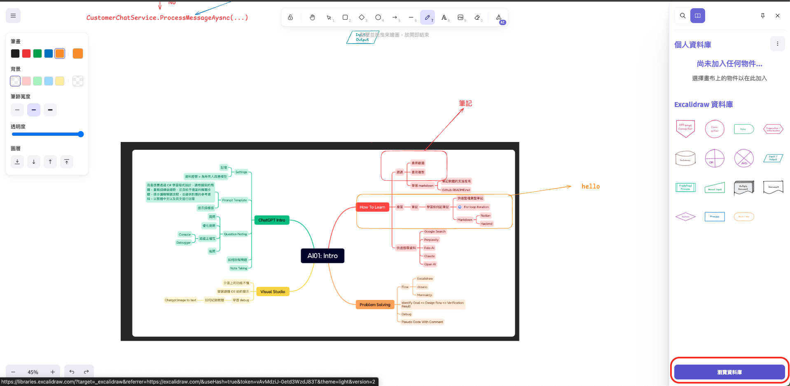
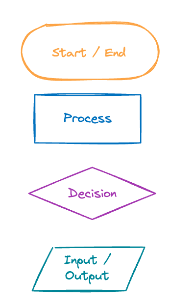
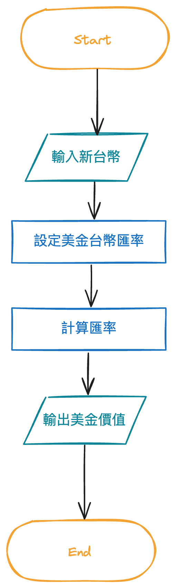
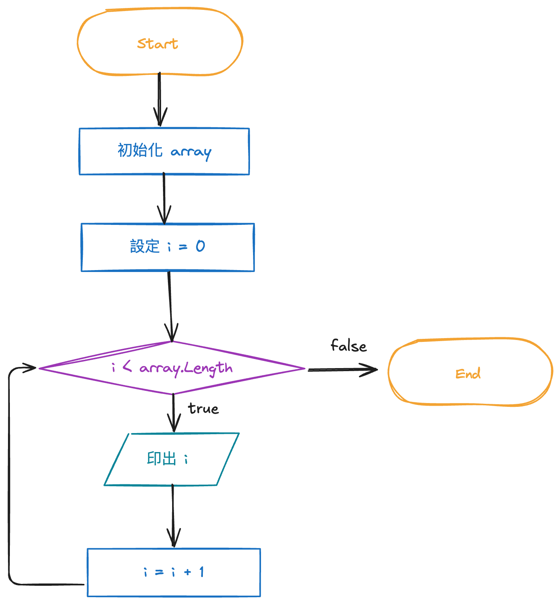
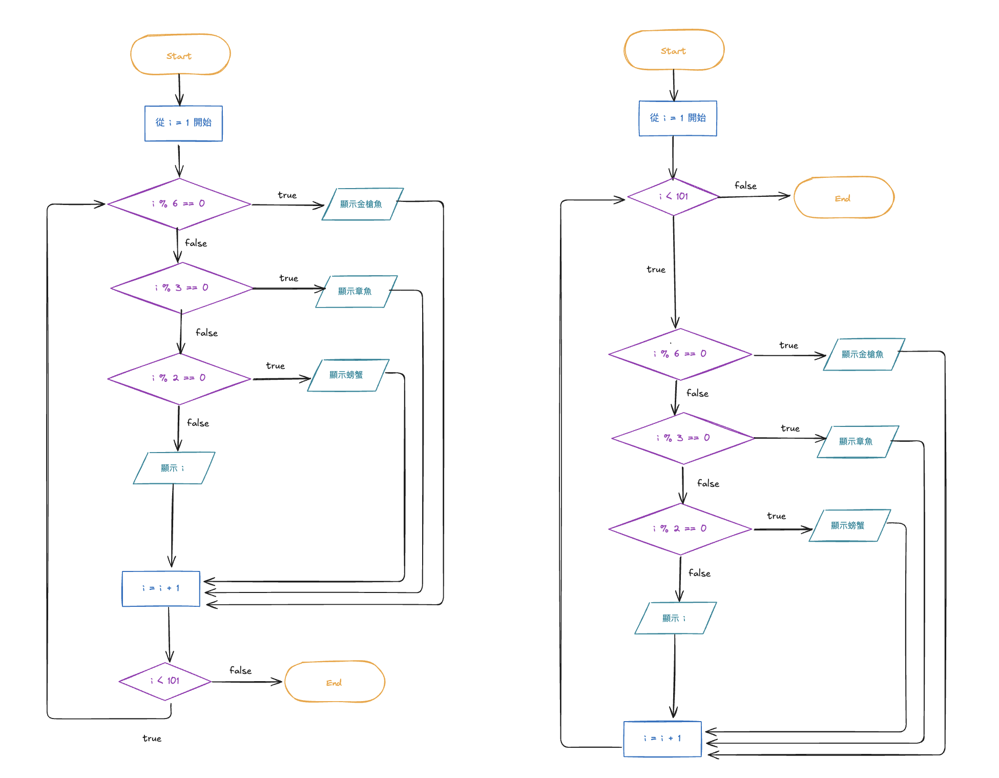
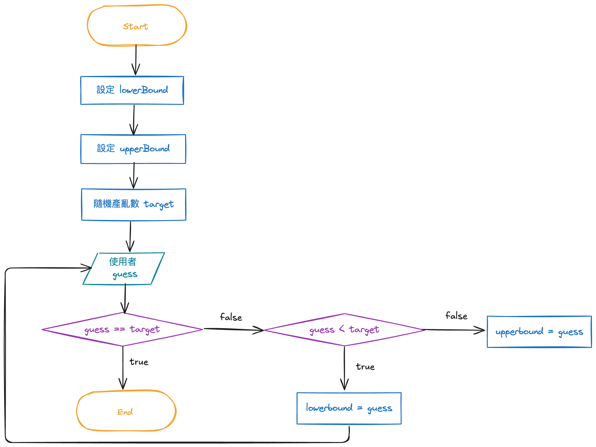

# build school note guide

## outline
- 知識吸收的學習流程
- VS Code 基本操作教學
- VS Code 安裝方式
- VS Code 常用擴充功能
- 使用 Markdown 與心智圖整理資訊
- 如何有效使用 AI 提問
- 如何練習解題與設計演算法


## 吸收知識的流程
- 使用 Excalidraw 進行視覺化思考
- 用 Mind Map 與 Markdown 彙整筆記
- 透過實際 Coding 驗證所學內容
- 練習拆解問題並培養解題能力
- 練習向 ChatGPT、Gemini、Claude 清楚提問
- 進一步用 Agent Skills 自動化學習流程

## tools
> mindmap, markdown, flowchart
- Xmind, Drawnix
  - <https://xmind.com/download>
  - <https://drawnix.com/>
- Hackmd, Notion, Obsidian, Affine
- Drawio, Excalidraw
  -  <https://excalidraw.com/>

## install vscode extenstions
- excalidraw

- markmap


## markdown basic syntax
- [Lab第一個程式(Console App)](https://learn.build-school.com/courses/2023%e5%a4%8f%e5%ad%a3%e7%8f%ad%e5%85%88%e4%bf%ae%e8%aa%b2/lessons/day-1-3-31-c-%e7%a8%8b%e5%bc%8f%e5%85%a5%e9%96%80/topics/lab01-%e7%ac%ac%e4%b8%80%e5%80%8b%e7%a8%8b%e5%bc%8fconsole-app/)

> Markdown 是一種輕量級標記語言，易於閱讀和編寫，非常適合快速記錄學習內容。結合 AI，能讓你的筆記整理事半功倍。純文本格式，方便版本控制與分享。

- [https://hackmd.io/s/quick-start-tw](https://hackmd.io/s/quick-start-tw)
- 標題
- bullet list
- numbered list
- quote
- info
- code
- inline code
- comment
- picture upload
> https://github.com/weberyanglalala/Dotnet10AISamples

## 練習提問 GPT, Gemini



1. 提供上下文 Context 情境
2. 清楚描述你想達成的目標 Goal
3. 具體說明目前遇到的問題 Problem
4. 補充你已經嘗試過的方法
5. 附上相關錯誤訊息或程式碼，必要時可搭配截圖說明
6. 善用 ChatGPT、Claude、Gemini 的網頁搜尋功能補充背景資料
7. 對 AI 提供的結果實際測試與驗證

> 請問 C# 主控台應用程式程式不使用最上層陳述式是什麼意思請幫我使用網頁搜索查詢相關的 Microsoft 文件說明

> 請問 C# 主控台應用程式程式解決方案與專案的區別，請幫我使用網頁搜索查詢相關的 Microsoft 文件說明

> 請幫我彙整解決方案與專案的區別的部分筆記，以 markdown 形式輸出

### 驗證 AI 輸出的正確性

* 不要盲目複製貼上 AI 提供的程式碼
* 觀察程式執行過程，確認輸出結果是否正確

## 練習設計演算法

- 先明確描述要解決的問題
- 定義問題的上下文與預期產出的結果
- 規劃資料處理邏輯與執行步驟
- 設計測試資料來驗證演算法是否正確

## excalidraw
- [excalidraw](https://excalidraw.com/)
- Square
- Arrow
- Text
- Draw
- Export as image
- Download Packages for flowchart: Flow Chart Symbols
  - Start/End Node
  - Process
  - Decision
  - Input/Output





## 刻意練習

- 大腦編譯器，大腦執行器
- 釐清脈絡
  - excalidraw
  - mermaid
  - plantuml
- 善用 Debug 工具

- [上課 Lab](https://learn.build-school.com/courses/2023%e5%a4%8f%e5%ad%a3%e7%8f%ad%e5%85%88%e4%bf%ae%e8%aa%b2/lessons/day-1-3-31-c-%e7%a8%8b%e5%bc%8f%e5%85%a5%e9%96%80/topics/day-1-homework/)
- 美元兌換：輸入新台幣的金額，顯示對應的美金金額


```csharp
namespace Dotnet10ConsoleApp
{
    internal class Program
    {
        static void Main(string[] args)
        {
            Console.Write("請輸入新台幣數值：");
            decimal twd = decimal.Parse(Console.ReadLine());

            decimal usd = twd / 28m; // 匯率自己改
            //decimal rounded = Math.Round(usd, 2, MidpointRounding.AwayFromZero);
            Console.WriteLine($"對應的美金價值為：{usd}");
        }
    }
}

```

## 印出 1 - 10
- [上課 Lab](https://learn.build-school.com/courses/2023%e5%a4%8f%e5%ad%a3%e7%8f%ad%e5%85%88%e4%bf%ae%e8%aa%b2/lessons/day-2-4-10-c-%e7%a8%8b%e5%bc%8f%e5%9f%ba%e7%a4%8e/topics/lab09-%e9%97%9c%e6%96%bcarray/)

```csharp
namespace Dotnet10ConsoleApp
{
    internal class Program
    {
        static void Main(string[] args)
        {
            int[] array = new int[] { 1, 2, 3, 4, 5 };
            for(int i = 0; i < array.Length; i++)
            {
                Console.WriteLine(array[i]);
            }
        }
    }
}

```

## 先修課考核 Q1 : 字串轉換
- 目標方案名稱：StringReplace
- 專案名稱：StringReplace
- 專案類型：主控台應用程式
- 將 1 到 100 顯示在畫面上；遇到 2 的倍數顯示「螃蟹」，遇到 3 的倍數顯示「章魚」，同時為 2 與 3 的倍數時顯示「金槍魚」。



### version 01
```csharp
class Program
{
  static void Main(string[] args)
  {
    int i = 1;
    do
    {
      if (i % 6 == 0)
        Console.WriteLine("金槍魚");
      else if (i % 3 == 0)
        Console.WriteLine("章魚");
      else if (i % 2 == 0)
        Console.WriteLine("螃蟹");
      else
        Console.WriteLine(i);
      i++;
    } while (i < 101);
  }
}
```

### version 02

```csharp
class Program
{
  static void Main(string[] args)
  {
    for (int i = 1; i < 101; i++)
    {
      if (i % 6 == 0)
        Console.WriteLine("金槍魚");
      else if (i % 3 == 0)
        Console.WriteLine("章魚");
      else if (i % 2 == 0)
        Console.WriteLine("螃蟹");
      else
        Console.WriteLine(i);
    }
  }
}
```

## 終極密碼
- 目標方案名稱：NumberGuessing
- 專案名稱：NumberGuessing
- 專案類型：主控台應用程式
- 系統會隨機產生一個 1 到 100 的整數；使用者每次輸入一個 1 到 100 之間的整數後，若尚未猜中，需顯示目前剩餘的可能區間，並允許繼續猜測。
- 猜中時顯示「猜中了，答案是：（某數字）」。
- 需處理輸入超出範圍的情況。


```csharp
using System;

namespace GuessNumber
{
    class Program
    {
        static void Main(string[] args)
        {
            int upperBound = 100;
            int lowerBound = 1;

            Random rng = new Random();
            int target = rng.Next(lowerBound, upperBound + 1);

            while (true)
            {
                Console.Write($"請猜一個數字 ({lowerBound} ~ {upperBound}): ");
                int guess = int.Parse(Console.ReadLine()!);

                if (guess == target)
                {
                    Console.WriteLine("恭喜你猜對了！");
                    break;
                }
                else if (guess < target)
                {
                    lowerBound = guess;
                    Console.WriteLine("太小了！");
                }
                else
                {
                    upperBound = guess;
                    Console.WriteLine("太大了！");
                }
            }
        }
    }
}
```

## 數字三角形

### **專案配置**

* 新增專案
* 目標方案名稱 TriangleNumber
* 專案名稱 TriangleNumber
* 專案類型 主控台應用程式(.Net Framework)

### **題目說明**

- 輸入數字1位數字(1~9)，並產生三角形。
- 55555
- x4444
- xx333
- xxx22
- xxxx1

```csharp
class Program
{
    static void Main(string[] args)
    {
        string input = Console.ReadLine();
        int target = int.Parse(input);
        //   target - i   i
        // 55555 0, 5
        //  4444 1, 4
        //   333 2, 3
        //    22 3, 2
        //     1 4, 1
        for (int i = target; i > 0; i--)
        {
            int spaceCount = target - i;
            string spacePart = new string(' ', spaceCount);
            string numberPart = new string(i.ToString()[0], i);
            Console.WriteLine(spacePart + numberPart);
        }
    }
}
```